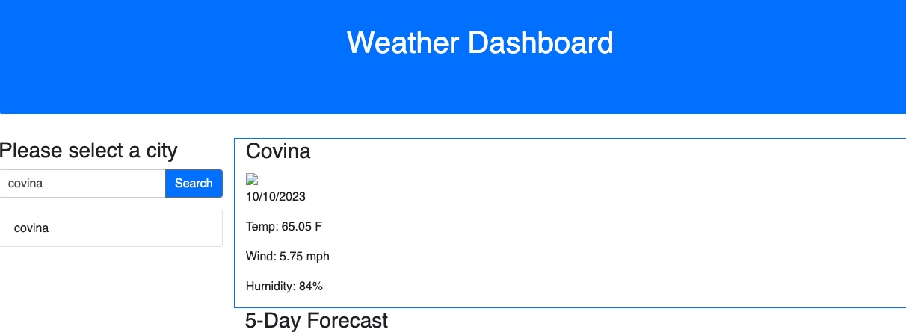

# Weather Dashboard Project

## Description

In this project, I created a weather lookup dashboard. The dashboard contains dynamic elements which were achieved by using server side and third-party APIs. The dashboard contains a search input bar with an associated search button. The user is able to input a city name and retrieve the current weather and todays date. The search input is also logged to local storage.

This project provided me with an opportunity to practice designing dynamic application that utilize calling on server-side APIs to retrieve searched information.

*** View deployed appication [HERE](https://aaront080.github.io/weather-dashboard-hw/).

Snapshot

Credits
-Xpert Learning Assistant for general questions and examples

-[Bootstrap layout resource](https://getbootstrap.com/docs/4.0/layout/overview/)]

-[Bootstrap components resource](https://getbootstrap.com/docs/4.0/components/alerts/)

-[jQuery ajax resource](https://api.jquery.com/jquery.ajax/)

-[Open Weather 5 day forecast resouce](https://openweathermap.org/forecast5)

-[Open Weather current weather data resource](https://openweathermap.org/current)

-[Local storage resource](https://developer.mozilla.org/en-US/docs/Web/API/Window/localStorage)
